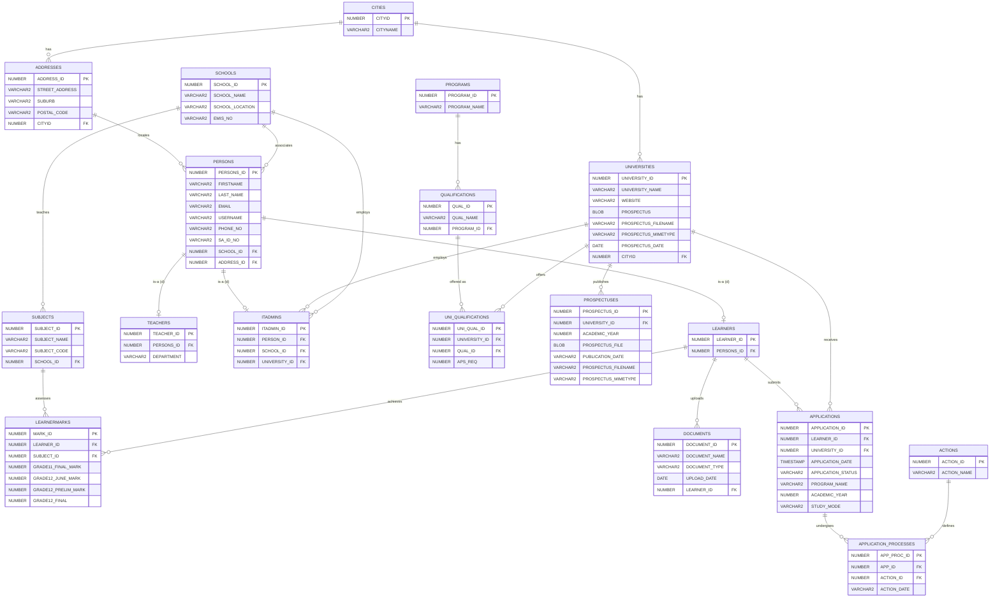

```mermaid
erDiagram
    %% Subtype/Supertype specialisation (Disjoint Constraints)
    %% Note: Modeled as 1-to-(0..1) to visually distinguish the hierarchy
    PERSONS ||--o| LEARNERS : "is-a (d)"
    PERSONS ||--o| TEACHERS : "is-a (d)"
    PERSONS ||--o| ITADMINS : "is-a (d)"

    %% Standard Relationships
    PROGRAMS ||--o{ QUALIFICATIONS : "has"
    QUALIFICATIONS ||--o{ UNI_QUALIFICATIONS : "offered as"
    UNIVERSITIES ||--o{ UNI_QUALIFICATIONS : "offers"
    CITIES ||--o{ UNIVERSITIES : "has"
    CITIES ||--o{ ADDRESSES : "has"
    ADDRESSES ||--o{ PERSONS : "locates"
    SCHOOLS ||--o{ PERSONS : "associates"
    UNIVERSITIES ||--o{ PROSPECTUSES : "publishes"
    SCHOOLS ||--o{ SUBJECTS : "teaches"
    UNIVERSITIES ||--o{ ITADMINS : "employs"
    SCHOOLS ||--o{ ITADMINS : "employs"
    SUBJECTS ||--o{ LEARNERMARKS : "assesses"
    LEARNERS ||--o{ LEARNERMARKS : "achieves"
    LEARNERS ||--o{ DOCUMENTS : "uploads"
    LEARNERS ||--o{ APPLICATIONS : "submits"
    UNIVERSITIES ||--o{ APPLICATIONS : "receives"
    APPLICATIONS ||--o{ APPLICATION_PROCESSES : "undergoes"
    ACTIONS ||--o{ APPLICATION_PROCESSES : "defines"

    %% Table Definitions
    CITIES {
        NUMBER CITYID PK
        VARCHAR2 CITYNAME
    }
    ADDRESSES {
        NUMBER ADDRESS_ID PK
        VARCHAR2 STREET_ADDRESS
        VARCHAR2 SUBURB
        VARCHAR2 POSTAL_CODE
        NUMBER CITYID FK
    }
    SCHOOLS {
        NUMBER SCHOOL_ID PK
        VARCHAR2 SCHOOL_NAME
        VARCHAR2 SCHOOL_LOCATION
        VARCHAR2 EMIS_NO
    }
    PROGRAMS {
        NUMBER PROGRAM_ID PK
        VARCHAR2 PROGRAM_NAME
    }
    QUALIFICATIONS {
        NUMBER QUAL_ID PK
        VARCHAR2 QUAL_NAME
        NUMBER PROGRAM_ID FK
    }
    ACTIONS {
        NUMBER ACTION_ID PK
        VARCHAR2 ACTION_NAME
    }
    PERSONS {
        NUMBER PERSONS_ID PK
        VARCHAR2 FIRSTNAME
        VARCHAR2 LAST_NAME
        VARCHAR2 EMAIL
        VARCHAR2 USERNAME
        VARCHAR2 PHONE_NO
        VARCHAR2 SA_ID_NO
        NUMBER SCHOOL_ID FK
        NUMBER ADDRESS_ID FK
    }
    LEARNERS {
        NUMBER LEARNER_ID PK
        NUMBER PERSONS_ID FK
    }
    TEACHERS {
        NUMBER TEACHER_ID PK
        NUMBER PERSONS_ID FK
        VARCHAR2 DEPARTMENT
    }
    UNIVERSITIES {
        NUMBER UNIVERSITY_ID PK
        VARCHAR2 UNIVERSITY_NAME
        VARCHAR2 WEBSITE
        BLOB PROSPECTUS
        VARCHAR2 PROSPECTUS_FILENAME
        VARCHAR2 PROSPECTUS_MIMETYPE
        DATE PROSPECTUS_DATE
        NUMBER CITYID FK
    }
    ITADMINS {
        NUMBER ITADMIN_ID PK
        NUMBER PERSON_ID FK
        NUMBER SCHOOL_ID FK
        NUMBER UNIVERSITY_ID FK
    }
    PROSPECTUSES {
        NUMBER PROSPECTUS_ID PK
        NUMBER UNIVERSITY_ID FK
        NUMBER ACADEMIC_YEAR
        BLOB PROSPECTUS_FILE
        VARCHAR2 PUBLICATION_DATE
        VARCHAR2 PROSPECTUS_FILENAME
        VARCHAR2 PROSPECTUS_MIMETYPE
    }
    UNI_QUALIFICATIONS {
        NUMBER UNI_QUAL_ID PK
        NUMBER UNIVERSITY_ID FK
        NUMBER QUAL_ID FK
        NUMBER APS_REQ
    }
    SUBJECTS {
        NUMBER SUBJECT_ID PK
        VARCHAR2 SUBJECT_NAME
        VARCHAR2 SUBJECT_CODE
        NUMBER SCHOOL_ID FK
    }
    LEARNERMARKS {
        NUMBER MARK_ID PK
        NUMBER LEARNER_ID FK
        NUMBER SUBJECT_ID FK
        NUMBER GRADE11_FINAL_MARK
        NUMBER GRADE12_JUNE_MARK
        NUMBER GRADE12_PRELIM_MARK
        NUMBER GRADE12_FINAL
    }
    DOCUMENTS {
        NUMBER DOCUMENT_ID PK
        VARCHAR2 DOCUMENT_NAME
        VARCHAR2 DOCUMENT_TYPE
        DATE UPLOAD_DATE
        NUMBER LEARNER_ID FK
    }
    APPLICATIONS {
        NUMBER APPLICATION_ID PK
        NUMBER LEARNER_ID FK
        NUMBER UNIVERSITY_ID FK
        TIMESTAMP APPLICATION_DATE
        VARCHAR2 APPLICATION_STATUS
        VARCHAR2 PROGRAM_NAME
        NUMBER ACADEMIC_YEAR
        VARCHAR2 STUDY_MODE
    }
    APPLICATION_PROCESSES {
        NUMBER APP_PROC_ID PK
        NUMBER APP_ID FK
        NUMBER ACTION_ID FK
        VARCHAR2 ACTION_DATE
    }

```
